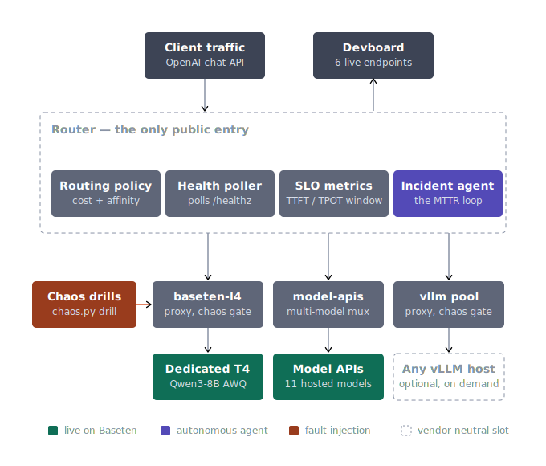
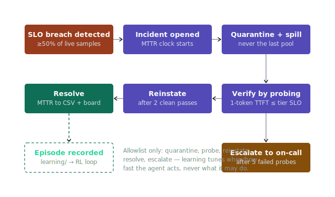
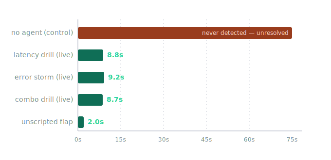

# baseten-mvp — an agentic inference control plane on Baseten

Once a model is deployed, production inference is won or lost on keeping it
**fast, reliable, and economical**. This project makes that loop *agentic*,
end to end, on live Baseten infrastructure:

- a **docs-grounded agent** (trained on all 394 pages of docs.baseten.co)
  de-risks deployment — it diagnosed three of our six real deployment
  failures from the docs, with citations, and wrote the activation runbook
- an **SLO-driven incident agent** turns cluster degradation into a
  self-healing non-event — live MTTR of **8.8–9.2 seconds** versus
  *never* in the agent-off control run
- every number on the dashboard **traces to a CSV** in `benchmarks/raw/`,
  and every incident the agent works becomes a **recorded episode** in
  `learning/` — the substrate for a reinforcement-learning loop over the
  agent's own policy

> Extracted from the multi-cloud [ai-native-pipeline](../ai-native-pipeline)
> project as a focused, Baseten-native MVP. The vendor-neutral slot in the
> architecture is deliberate: a second cloud is one YAML row, not a rewrite.

## Architecture



One router is the only public entry. It owns per-request decisions
(prefix-affinity, cost ranking, health) across two Baseten pools that are
genuinely different failure domains on the same platform:

| pool | what it is | fails via | billed |
|---|---|---|---|
| `baseten-l4` | dedicated T4x8x32 running **Qwen3-8B-AWQ** (open weights) via custom Truss + vLLM ([deploy/baseten/vllm-truss](deploy/baseten/vllm-truss)) | SKU walls, OOM, dep skew, cold starts | $0.90/hr while up |
| `model-api-spill` | Baseten's serverless **Model APIs** — one mux pool serves the whole 11-model catalog ([configs/inference-registry.yaml](configs/inference-registry.yaml)) | account-tier rate limits (429s) | per token |

Chaos is injected at the **pool proxies** (`CHAOS_ENABLED=1`), so drills
degrade traffic in front of *real* clouds without touching them.

## The agentic loop



The incident agent watches the same TTFT/TPOT samples real traffic produces
(never just `/healthz` — a pool can answer health checks while serving
garbage). Its production surface is a **closed allowlist**: quarantine,
probe, reinstate, resolve, escalate. Guard rails were earned through chaos
testing, not foresight: never quarantine the last healthy pool (including
the same-tick race), sticky quarantine that health polls cannot lift,
streaming-TTFT probes judged against the tier's own SLO, escalate-once then
slow-poll.

Every resolved incident is projected into a JSONL **episode** — active
policy parameters, action trajectory, probe results, shaped reward — by
[services/router/router_app/learning.py](services/router/router_app/learning.py).
See [learning/README.md](learning/README.md) for the episode schema and the
planned RL loop (offline policy evaluation → parameter search → shadow →
gated promotion). The invariant: **learning tunes when and how fast the
agent acts, never what it is allowed to do.**

## Results (recorded, replayable)



| measurement | value | evidence |
|---|---|---|
| MTTR, latency fault on live dedicated T4 | **8.8s** | `benchmarks/raw/chaos_drill_latency_20260703-154911.csv` |
| MTTR, 90% error storm on live T4 | **9.2s** | `benchmarks/raw/chaos_drill_errors_20260703-155011.csv` |
| MTTR, unscripted health flap (nobody injected it) | **2.0s** | devboard incident snapshot |
| control run, agent off, same fault | **unresolved after 75s** | `benchmarks/raw/chaos_drill_latency_20260702-201639.csv` |
| users served by the spill pool mid-quarantine | 10 requests, 0 errors | router route events |
| blended cost at the live mix | **$2.17 / 1M tokens** (−27% vs single-pool) | devboard capture 2026-07-03 |
| dedicated pool, warm | TTFT p50 333ms · ~34ms/token | live headers, voice SLO: <500ms / <60ms |

Three adversarial eval agents (SLO-auditor, chaos-agent, staff-skeptic)
gate every feature; their verdicts live in [evals/](evals/). A 16-entry
first-hand [friction log](docs/FRICTION_LOG.md) records everything that
broke on the way to production — the product-management artifact.

## Quickstart (no keys, no GPU, no network)

```bash
./scripts/run_local_stack.sh              # pools run as faithful sims
open http://localhost:8090/devboard
python3 tools/chaos.py drill --suite --model qwen3-8b --rps 2
```

The sims model the economics that make serving hard (prefill/decode split,
KV cache TTL, cold starts, per-token prices from the real catalog), so the
whole control plane — router, agent, devboard, drills, episode recording —
runs and tests deterministically on a laptop.

## Going live on Baseten

```bash
export BASETEN_API_KEY=...                                  # env only, never files
export BASETEN_BASE_URL=https://model-<id>.api.baseten.co/environments/production
export BASETEN_CHAT_PATH=/predict                           # custom-Truss invocation
export BASETEN_API_BASE_URL=https://inference.baseten.co    # Model APIs spill pool
./scripts/run_local_stack.sh
```

Full runbooks: [deploy/LIVE_SETUP.md](deploy/LIVE_SETUP.md) (wiring,
reactivation, **shutdown checklist so nothing bills idle**),
[deploy/baseten/ACTIVATION_RUNBOOK.md](deploy/baseten/ACTIVATION_RUNBOOK.md)
(docs-cited activation gotchas), [deploy/baseten/DEBUG.md](deploy/baseten/DEBUG.md)
(the six-failure forensics that produced the working config).

## Deploying a model with the docs agent

`.claude/agents/baseten-docs.md` defines a Claude Code subagent grounded in
a complete snapshot of docs.baseten.co (`tools/kb/`, with a term-frequency
search CLI). Its rules: search first, read whole pages, **cite the Source
URL for every claim, say so when the docs don't answer, never spend money.**
It diagnosed the Engine-Builder build failure (host-memory starvation),
identified that `fp8_kv` was *not* the culprit (the caveat is Qwen2-only),
and found that Model API rate limits are account-tier — each finding
grounded to a URL. Refresh the corpus:

```bash
python3 tools/kb/index_kb.py tools/kb/baseten   # after re-downloading llms-full.txt
python3 tools/kb/search.py tools/kb/baseten "engine builder quantization"
```

## Onboarding skill

`npx skills add vsiwach/baseten-mvp` installs **baseten-onboard**
([skills/baseten-onboard/](skills/baseten-onboard/)) — a guided first-deploy
journey for any agent client (Claude Code, Claude Desktop with the Baseten
MCP connector, Cursor, …): intake → live-priced serverless-vs-dedicated
decision → MCP deploy → readiness gate → first inference → handoff.

## Live console

**https://baseten-reliability-console.vercel.app** — the bring-your-own-key
Reliability Console ([console-live/](console-live/), read-only by default
with opt-in gated manage actions): paste a Baseten API key and see your
deployments' real metrics, SLO posture, and one grounded recommendation
each. The key stays in the browser; a same-origin proxy forwards it
per-request to api.baseten.co only.

## Repository map

```
configs/            routing policy, placement, release, model registry (plain YAML)
services/router/    the control plane: policy, health, metrics, incident agent,
                    devboard endpoints, episode recording   [113 tests]
services/llm/       pool proxy: adapters (Baseten Truss / Model APIs / vLLM),
                    catalog mux, chaos gate, faithful sim   [52 tests]
deploy/baseten/     working Truss (vllm-truss/), management CLI, catalog,
                    runbooks + failure forensics
deploy/runpod/      budget-guarded pod lifecycle for the vendor-neutral slot
learning/           episode schema + backfilled real episodes + RL-loop plan
tools/chaos.py      fault injection + scripted MTTR drills (evidence writer)
tools/kb/           docs corpus + search behind the baseten-docs agent
benchmarks/         load harness + raw/ (every number's source of truth)
evals/              the three adversarial eval agents' verdicts + evidence
console-live/       BYO-key live Reliability Console (deployed, see above)
site/               static replay of the live demo (Vercel-ready, no keys)
docs/               friction log, JD, diagrams
```

## Roadmap

1. Wire the release engine (canary/shadow/A-B with drain + probe gates —
   built and tested, not yet live) to Baseten's promote/rolling deploys.
2. Close the RL loop: offline policy evaluation over `learning/episodes/`,
   bandit over `AgentConfig`, shadow-mode candidate policies on drills.
3. Multi-region / active-active as first-class placement policy.
4. Light up the vendor-neutral pool slot when a second provider is needed.
